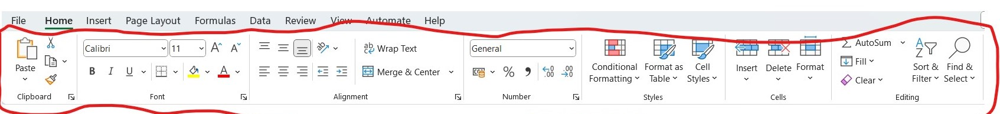
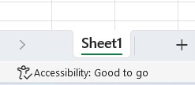
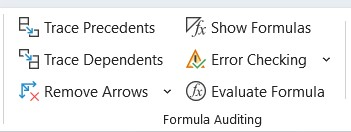

<style type="text/css">
  body{
  font-size: 18pt;
}
h1,h2,h3,h4,h5,h6{
  font-size: 24pt;
}
caption {
  color: red;
  font-weight: bold;
  font-size: 2.0em;
} 
blockquote {
    padding: 10px 20px;
    margin: 0 0 20px;
    font-size: 22px;
    border-left: 5px solid #eee;
    border-left-width: 5px;
    border-left-style: solid;
    border-left-color: rgb(238, 238, 238);
}
</style>
  
  ```{r setup, include=FALSE}
knitr::opts_chunk$set(echo = TRUE)
```


# EXCEL ADVANCE TRAINING FOR DATA SCIENCE {.tabset}

## Welcome 


## Introduction 

### Why Excel and Relation to Data SCience

Understanding of concepts is more important than the tool, the operation of mathematical/scientific formulas go a long way to deeper knowledge of a concept.

The area of a square:

  - What is it?
  - What tools can you use?

From the above example it's clear understanding the concept is inconsequential to the tool, hence the reason data science with Excel. 
Every tool has its on advantage over the other. The overarching question `Does the end justify the means or Means justify the end`

*Definition:*

|ITEM| Description | | 
|:---:|:---|---|
|**Data Science**     | In my own definition being able to extract information from different raw data sources and making sense out of it. Further extrapolation or predicting future information     ||  
|**Excel**     | Microsoft Excel - Spreadsheet         ||
|**R**     | Programming Language for statistical analysis and automated execution         ||
|**Python**     | Programming Language for automation execution         ||


---------------------


### What we need

For this training will be looking at <mark>spreadsheets</mark> using the Microsoft Excel.

Numerous spread sheet application/software are available just to name a few:

  - Microsoft Excel {width=10px}
  - LibreOffice {width=100px}
  - Google sheets {width=10px}


Some of the spreadsheets are paid for others a free and open source.
Access can be both online (using your browsers i.e. Internet Explorer/Google Chrome/Mozilla) and offline (As a stand alone software installed on your computer/mobile phone)


### Assumptions

Have some limited or little knowledge of Microsoft excel functions e.g `=sum(C1,C2)`, though not mandatory it makes it easier to grasp concepts slightly faster.

Though if you remember the simple mathematics which we do everyday of summing and adding up *money* then you are good :).

---------------------


### Requirements

* Working computer (Laptop/Desktop)
* Access to internet once in a while to download a few resource materials
* **Interest and desire** to learn new concepts


### Overview of our knowledge

* Operating and maneuvering on a PC/Laptop
* Basic knowledge of Ms Excel Interface


### Teaching guide

* Mixed instructional guide, with the presentation but focused on getting more hard skills
* Prepare to write Excel formulas
* Engagements and practice on the fly


### About the trainer

Just me but you can see you can get the details from [qprop](https://qprop.me/about)


## Day 1 {.tabset .tabset-pills}


### Navigating Ms Excel


**Key Guiding Concepts**


Vocabulary to be used.

- **Menu Bar**
  
- **Menu Ribbon**
  
- **Sheet**

  {width=150px}
- **Formula**
  Inputs placed inside cells to do various calculations
  
- **Rows**
  Horizontal cells from `1` to Maximum of `1048576`

- **Columns**
  Vertical cells from `A` to Maximum of `XFD`
  
### Menu's Video
  
<video src="Images/ex_menu_ribon.mp4" width="320" height="240" controls></video>

### Formula

Different option to input formula:

> **Using the menu** : Menu <mark>Formulas</mark> then pick the options menus available

> **Direct formula in cell** : With the cell start with <mark>=</mark> followed with the formula. You have to have an understanding of the formula

**My cardinal rule in excel there is always more than one way to achieve the same result.**

Lets look at example:


      How can we sum up different numbers in different cells to get the total

### Importing data

Hallmark of dealing with data is being able to source the data, for purposes of terminology we will be calling this importing data.

There are so many data sources, some we can source `online`, `excel workbooks`, `database files` e.t.c.

> **<mark>Data</mark> Menu** : There ways to import from different sources:
  - Text/csv (Comma Separated Values)
  - From web source links (*Requires tabular data online*). We can test this with [here](https://en.wikipedia.org/wiki/Counties_of_Kenya) requires internet
  - `Get Data` can connect to database systems.

### Exercise Day 1

Download EPL (English Premier League data) [here](https://github.com/Qprop/ExcelDsNbo/tree/master/Exercise/Data/English Premier League_09_19) and [original sources](https://datahub.io/sports-data/english-premier-league#resource-english-premier-league_zip) **Requires Internet**

Or to downloand click on google drive link [here](https://drive.google.com/drive/folders/1AvtAJBcw9OMURIqFdEerspsVhm5pP7ep?usp=sharing) this will send a request to access and once accepted you can access the data files here.


Data content:
  - 10 separate csv files
  - Each csv is all the games play from 2009 to 2019
  - All the columns are exactly the same
  
Exercise:
  - Import all the files into 1 excel work book (Use any method you deem fit)

## Day 2 {.tabset .tabset-pills}

### Logic Functions

#### Introduction

Understanding of logical fundamentals.

Logic here we are talking about conditions, something is true because of something happening. Because of certain biological functions and nature that being the condition you are either `Male` or `Female`. 

Let me take you back to school the difference between having a pass and fail was certain marks. That is if you have anything below `40%` you have failed and anything above that you have passed.


#### Conditions 

Comparison:

  - AND
  - OR
  - NOT
  
  
Evaluations:
  
  - IF

Aggregations:
  
  - COUNTIF and its pronouns COUNTIFS
  - SUMIF and its counterpart SUMIFS
  - AVERAGEIF and its counterpart AVERAGEIFS


### Get our hands dirty

We will use the `_01_SalaryDepart.xlsx` data which can be gotten in the `Data\_01_SalaryDepart.xlsx` folder.

#### Get our hands dirty

    Using the data salary attempt the below practices
    
    -   Total salary by Department
    -   Total salary by Building
    
    -   Count of staff by Department
    -   Count of Staff by Building
    
    
    -   Average Salary of staff by Department
    -   Average Salary of Staff by Building


### Text Functions

#### Introduction

Understanding of text fundamentals.

Text here can be alphabets, words, numbers and other special characters `&!@#*()`.

Normally we are challenged on how to try to get information out cells with text data. 

Example if you are trying to change lowercase values to uppercase values or Proper sentences or words.

-   You want to extract a word. 
-   Trying to pick the first or last number of characters.
-   Searching for texts
-   Splitting texts


#### Text Formulas 

Under the `Formulas >  Text`:

  - LEFT
  - RIGHT
  - LEN
  - MID
  - PROPER
  - UPPER
  - LOWER
  
  
### Get our hands dirty

We will use the `_01_SalaryDepart.xlsx` data which can be gotten in the `Data\_01_SalaryDepart.xlsx` folder.

    Using the data salary attempt the below practices
    
    -   Convert the Employee name to Lower case
    -   Convert the Employee name to Upper case
    -   Convert the Employee name to Proper case
    
    -   Split Employee name to First Name and Last Name
    -   Change the comma (,) value separating the first name and last name with (:)

    -   Play with the CHAR Function what does it do


## Day 3 {.tabset .tabset-pills}

### Date Functions

#### Introduction

Date is one of teh most complicated types of data to deal with, there are different ways of presenting date data types.

  `Day-Month-Year` - `17-09-2023`
  
  `Month-Day-Year` - `09-17-2023`
  
  `Month-Day-Year` - `Sep-17-2023`
  
  `Month-Day-Year` - `Sep-17-23`
  
  `Year-Month-Day` - `2023-09-17`
  
  `Year-Day-Month` - `2023-17-09`


#### Date Formulas 

Under the `Formulas >  DATE`:

  - TODAY
  - MONTH
  - DAY
  - YEAR
  - NOW
  - DATEVALUE
  - TIMEVALUE
  
  
### Get our hands dirty

We will use the `_01_SalaryDepart.xlsx` data which can be gotten in the `Data\_01_SalaryDepart.xlsx` folder.


    Using the data salary attempt the below practices
    
    -  From 'Hire Date' pick the Year of employment
    -  From 'Hire Date' pick the Month of employment
    -  From 'Hire Date' pick the Day of employment
    -  From 'Hire Date' pick the Weekday of employment


### Pivot tables

Data in its self in its raw form might not have meaning, but aggregating it to small manageable chunks creates knowledgeable insights. 

100's of rows and columns doesn't make sense but an aggregation of the values to sum, count's, means and statistical values converts them to valuable information.

Here is where pivot tables comes in handy.

From `Insert >  PivotTables`, you can create pivot tables.

  - Create pivot table
  - Calculate values
  - Generate totals and subtotals
  - Add slicers
  
### Get our hands dirty

    Using the data salary attempt the below practices
    
    -   Total salary by Department
    -   Total salary by Building
    
    -   Count of staff by Department
    -   Count of Staff by Building
    
    
    -   Average Salary of staff by Department
    -   Average Salary of Staff by Building

## Day 4 {.tabset .tabset-pills}    

### Visualization

<br><br><br>


#### Data can be fun | Visualization and story telling

<br><br><br>

```{r echo=FALSE, warning=TRUE}
knitr::include_url("https://www.gapminder.org/tools/#$chart-type=bubbles&url=v1")

```

<br><br><br>


Beauty lies in the eyes of the beholder, data has to be simplified further to make sense to be able to achieve this we need to have visuals e.g graphs or charts.

Excel has charting functionalists.

From `Insert >  Charts`, launches the power query editor.

  - Bar Chart
  - Line Chart
  - Pie Chart
  
  
### Get our hands dirty

    Using the data salary attempt the below practices
    
    -   Load the salary data
    -  Draw a bar graph of No. of Employees within the different departments
    -  Draw a bar graph of No. of Employees within the different buildings
    -  Draw a line graph showing the different hire dates in months for the different hires
    -  Draw a pie chart on the status of employees


### Power Query

<br><br><br>

Introduced to help faster execution and overcome limitations present in excel, that is number of rows and columns. 

Power query models are limitless with ability to do data manipulations and transformations.

Power tools were integrated and include Power Query and supporting Power Pivots.

From `Data >  Get Data`, launches the power query editor.

  - Create power models
  - Familiarization of 
  - Generate totals and subtotals
  - Add slicers
  
### Get our hands dirty

    Using the data salary attempt the below practices
    
    -   Load the salary data
    -  From 'Hire Date' pick the Year of employment
    -  From 'Hire Date' pick the Month of employment
    -  From 'Hire Date' pick the Day of employment
    -  From 'Hire Date' pick the Weekday of employment
    -  Split 'Employee Name' to column with First Name and Last Name
    -  Change First Name and Last Name to Capital cases
    -  Calculate the years of service since time employee got employed.

  
## Bonus Materials {.tabset .tabset-pills}

### **Other Concepts**

- Locating formulas
- Auditing Tools {width=150px}
- Column/Row References `A:A` / `1:1`
- 

### **Shortcut CheatSheet**


|ITEM| Short Cut | Description | | 
|:---:|:---:|:---|---|
|<mark>BASIC</mark>|**CTRL+C**     | Copy          ||  
||**CTRL+V**     | Paste         ||
||**CTRL+F**     | Find/Search         ||
||**CTRL+H**     | Find & Replace         ||
||**CTRL+G**     | Go To Special Dialogue         ||
||**CTRL+ALT+V** | Paste Special ||
||**CTRL+;** | Current Date ||
||**CTRL+SHIFT+;** | Current Time ||
||**CTRL+SPACE** | Select Column ||
||**SHIFT+SPACE** | Select Row ||
|<mark>WORKBOOK</mark>||||
||**CTRL+N** | Open New Workbook ||
||**F12** | Save as Dialoge box ||
||**F2** | Enter cell to edit ||
||**F4** | Repeat previous keyboard action ||
|<mark>FORMATTNG</mark>||||
||**CTRL+1** | Formating cell dialogue ||
||**CTRL+2** | Cell Bold ||
||**CTRL+3** | Cell Italics ||
||**CTRL+SHIFT+1** | Formating cell to Number ||
||**CTRL+SHIFT+2** | Formating cell to Custom ||
||**CTRL+SHIFT+5** | Formating cell to % ||
||**CTRL+SHIFT+1** | Formating cell to Number ||
|<mark>INSERTION/DELETION</mark>||||
||**CTRL+SHIFT++** | Insert Dialoge box ||
||**CTRL+-** | Delete Dialoge box ||
||**CTRL+(** | Hide row ||
||**CTRL+SHIFT+(** | Unhide row ||
||**CTRL+)** | Hide column ||
|<mark>SHEET MANIPULATION</mark>||||
||**CTRL+A** | Select all data ||
||**CTRL+.** | Move to the corners of each selected array ||


